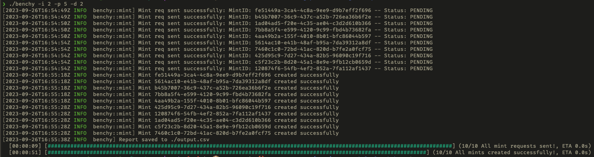

## Description

A CLI tool benchmark minting speeds using [Holaplex](https://holaplex.com)'s [HUB API](https://api.holaplex.com)

## Installation

1. Install Rust: https://www.rust-lang.org/tools/install
2. Clone the repository and navigate to the directory.
3. Run `cargo build --release`

## Configuration

Ensure you have the correct settings in your config file. Use [config-sample.json](config-sample.json) as a guide.
You can set the config path using the `CONFIG_PATH` environment variable or `--config` argument on each command.

## Usage

Rename `config-sample.json` to `config.json` (the default path).

Benchy allows you to set the number of iterations, parallelism and delay between iterations with CLI args.

```bash
benchy --iterations 2 --parallelism 5 --delay 2

# Or using short args
benchy -i 2 -p 5 -d 2
```

Above command will mint 10 nfts in 2 batches of 5 at the same time and will wait 2 seconds between each batch.

## Output



## Reporting

`Benchy` will save a report to `output.csv` be default. Can be changed with the `--output <file-path>` argument
Here will keep track of `mint_ids`, time it took to mint each one and if the mint was successful (with a reason if it wasn't)

```csv
cat output.csv
mint_id,completion_sec,retry_count,success,reason
fe51449a-3ca4-4c8a-9ee9-d9b7eff2f696,30,0,true,
5614ac10-e41b-48af-b95a-7da39312a8df,25,0,true,
b45b7007-36c9-437c-a52b-726ea36b6f2e,30,0,true,
7bb8a5f4-e599-4120-9c99-fbd4b73682fa,30,0,true,
4aa49b2a-155f-4010-8b01-bfc86044b597,30,0,true,
425d95c9-7d27-434a-82b5-96090c19f716,35,0,true,
120874f6-54fb-4ef2-852a-7fa112af1437,35,0,true,
1ad04ad5-f20e-4c35-ae04-c3d2d610b366,41,0,true,
c5f23c2b-8d20-45a1-8e9e-9fb12cb0659d,35,0,true,
7460c1c0-72bd-41ac-820d-b7fe2a0fcf75,35,0,true,
```

## Contributing

If you find any issues or would like to contribute to the project, feel free to open an issue or create a pull request on the repository.
